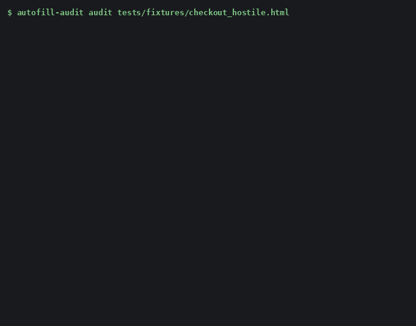
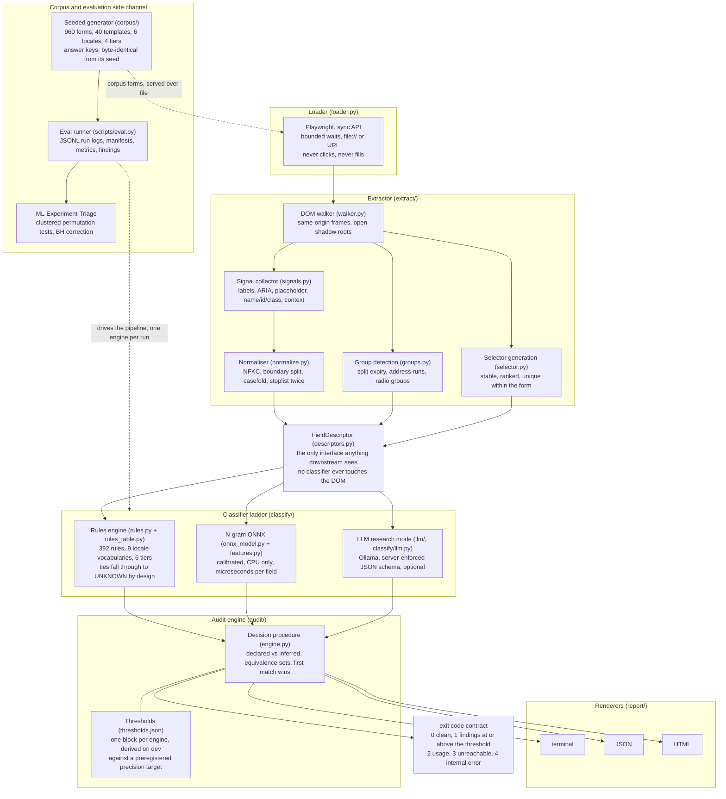
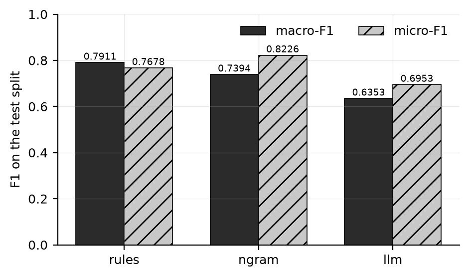
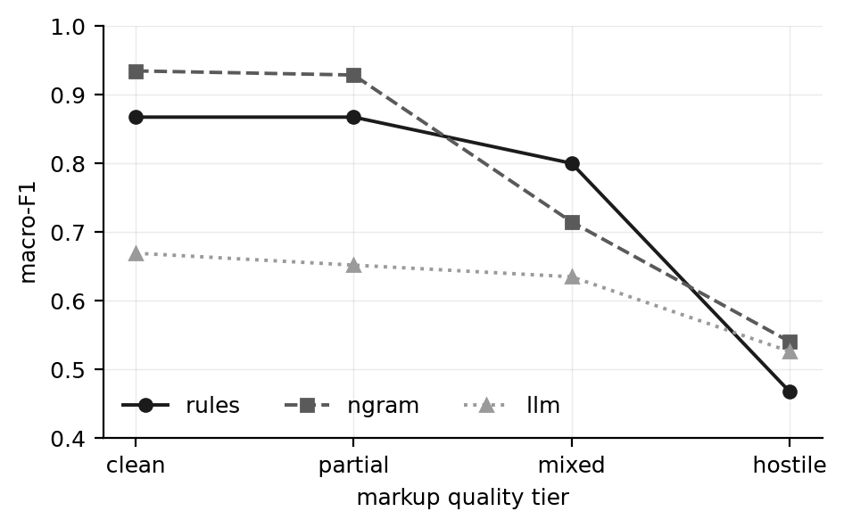
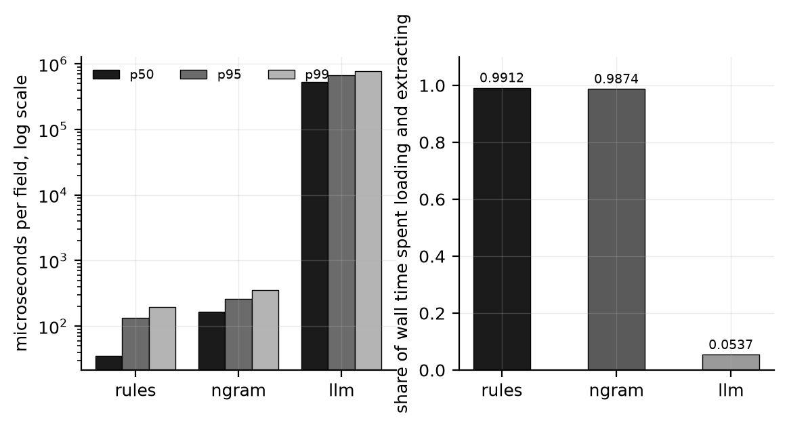

# autofill-audit  

[](https://github.com/Olajide-Badejo/Autofill_audit/actions/workflows/ci.yml)
[](LICENSE)

**Find every form field on a page that will not autofill, and get the exact attribute to add to each one.**



## Why

A browser autofills a field only when the markup gives it enough to recognise the field. When it cannot, someone types their address by hand, on a phone, at the last step of a checkout, and some of them give up.

The fix is already specified: the [WHATWG autofill token set](https://html.spec.whatwg.org/multipage/form-control-infrastructure.html#autofill) defines what `autocomplete` accepts, and the [Chrome team's form guidance](https://web.dev/learn/forms/) explains what browsers do with it. Knowing the rule is easy. Finding which of sixty controls on a page you did not write are broken, and what exactly to add to each, is not.

## Install

```bash
pipx install autofill-audit
playwright install chromium
```

## Quickstart

```bash
autofill-audit audit https://example.com/checkout
```

Real output against a checkout page written to get things wrong in the ways real checkouts do, trimmed to its first two findings:

```console
$ autofill-audit audit ./checkout.html
autofill-audit  file:///.../checkout.html

critical (6)

 control                         finding
 ──────────────────────────────────────────────────────────────────────────
 #ck-email                       MISSING_AUTOCOMPLETE
                                 add autocomplete="email" to #ck-email
                                 evidence: declaration:absent,
                                 label:email-words, label:address-word
                                 [rule tier HIGH]
 #ck-postcode                    OFF_SPEC_TOKEN
                                 autocomplete="zipcode" is not a valid
                                 autofill token; use "postal-code"
                                 evidence: declaration:off-spec,
                                 label:postcode-words [rule tier HIGH]

$ echo $?
1
```

A page where every control is correctly declared produces silence and exits `0`:

```console
$ autofill-audit audit ./checkout-fixed.html
No findings. Every control this tool could read is declared.

$ echo $?
0
```

It exits `1` when it finds something at or above the failure threshold, so it drops into a pipeline without a wrapper script.

```bash
autofill-audit audit ./checkout.html --format json --out report.json
autofill-audit audit ./checkout.html --format html --out report.html --fail-on warning
```

Other useful flags: `--engine` (`auto`, `rules`, `ngram`, `llm`), `--fail-on`, `--include-hidden`, `--no-frames`, `--config`. `--engine auto` is the default: it uses the model when one is available and the rule baseline when none is, and prints which. A published wheel carries no model, so a fresh install runs the rule baseline until you train one or point `AUTOFILL_AUDIT_MODEL_DIR` at a bundle.

## What it finds

| Severity | Codes |
|---|---|
| `critical` | `MISSING_AUTOCOMPLETE`, `WRONG_AUTOCOMPLETE`, `OFF_SPEC_TOKEN` |
| `warning` | `AUTOCOMPLETE_OFF`, `UNLABELED_FIELD`, `PLACEHOLDER_AS_LABEL`, `SPLIT_FIELD`, `COMPOSITE_FIELD`, `UNDETECTABLE_FIELD` |
| `info` | `GENERIC_IDENTIFIER`, `WRONG_INPUT_TYPE`, `MISSING_NAME_ATTR`, `EXTRACTION_INCOMPLETE` |
| `note` | `LOW_CONFIDENCE` |

Every finding names the signals that triggered it and carries a confidence or a documented tier, so you can argue with it. Every code, its trigger, its exact fix text and a worked example are in [`docs/findings.md`](docs/findings.md).

The whole product, in one attribute:

```html
<!-- will not autofill: nothing tells the browser what this control is -->
<input type="text" id="ck-email" placeholder="name@example.com">

<!-- will autofill -->
<input type="email" id="ck-email" autocomplete="email"
       placeholder="name@example.com">
```

## How it works



`FieldDescriptor` is the load-bearing contract: a classifier never sees the DOM and never sees an answer key. That boundary is why selector generation, group detection and every normalisation step are tested in milliseconds without a browser.

## How well does it work

Measured on a seeded synthetic corpus generated by this repository: forms across six locales and four markup-quality tiers, with whole templates held out so no test form shares an author with a training form.

Three engines were compared on the held-out test split: a rule table, a calibrated n-gram model exported to ONNX, and a 12-billion-parameter instruction model at 4-bit quantization served locally through Ollama ([run manifest](experiments/results/test/2026-08-26T20-32-48Z_p6-llm_6457ac7/manifest.json)).

**The rule baseline and the small ONNX model both beat the 12B local LLM.**



Both averages are shown because they disagree about which classical engine leads and agree about which came last: `rules` leads the label-weighted average and `ngram` leads the field-weighted one ([rules](experiments/results/test/2026-08-26T21-15-35Z_p6-rules_6457ac7/metrics.json), [ngram](experiments/results/test/2026-08-26T21-17-53Z_p6-ngram_6457ac7/metrics.json), [llm](experiments/results/test/2026-08-26T20-32-48Z_p6-llm_6457ac7/metrics.json)).



The n-gram model is strongest on clean and partial markup; the rule table degrades most on hostile markup, where labels are stripped; the language model is flattest and lowest almost everywhere ([tier grids](experiments/results/bench/2026-08-26T20-32-48Z_bench_6457ac7/benchmark.json)).



Both classical engines classify a field in well under a millisecond, and for them the browser is over 98% of the run, so the classifier is a rounding error on a page load. For the language model that inverts ([latency and wall time](experiments/results/bench/2026-08-26T20-32-48Z_bench_6457ac7/benchmark.json)). **This is the result most likely to hold on real pages, because it does not depend on the corpus being synthetic.**

Every number in this project resolves to a committed result file whose manifest resolves to a real commit, and a CI job walks that chain and fails if any step does not. These are measurements on generated forms: real-world accuracy is unmeasured and is stated as unmeasured.

**The full answer, including what it does not license:** [`docs/report.md`](docs/report.md).

## Scope

Deliberate boundaries, each a design decision.

- **One page per invocation.** No crawler, no sitemap walker, no depth flag. `--crawl` and `--depth` answer with the boundary and the reason rather than an unknown-option error.
- **Read-only.** It never types into a field, never submits, and holds no profile of values. `--fill` is answered the same way.
- **No markup rewriting.** Findings carry the fix as text. Rewriting a production template from a classifier's output is the failure mode the confidence thresholds exist to prevent.
- **Synthetic data only.** Nothing fetches HTML from a live site and keeps it. Fixtures use invented names and the officially published test card numbers; no real personal data is in this repository.
- **HTML forms only.** Native mobile forms, PDF forms and canvas-rendered widgets are out. A canvas is reported as undetectable rather than guessed at.
- **Closed shadow roots and cross-origin frames are reported, not read.** A hosted payment field is a correct pattern, and the finding says so instead of implying a defect.
- **It checks the markup, not the browser.** It verifies that a page gives the browser what it needs to autofill. It does not drive a browser's autofill and never claims to.

## Documentation

| | |
|---|---|
| [`docs/report.md`](docs/report.md) | How well it works, with the method and the limits |
| [`report/main.pdf`](report/main.pdf) | The full write-up: corpus, engines, statistics, predictions, limitations |
| [`report_debug/debug_report.pdf`](report_debug/debug_report.pdf) | The record of what went wrong and what was done about it |
| [Sample HTML report](https://htmlpreview.github.io/?https://github.com/Olajide-Badejo/Autofill_audit/blob/main/docs/examples/checkout_hostile_report.html) | The HTML renderer's real output, rendered in your browser ([source](docs/examples/checkout_hostile_report.html)) |
| [`docs/findings.md`](docs/findings.md) | Every finding code, trigger, fix text and example |
| [`docs/taxonomy.md`](docs/taxonomy.md) | The label set and where it comes from |
| [`docs/model-card.md`](docs/model-card.md) | The shipped model, what it was trained on, what is unmeasured |
| [`docs/adr/`](docs/adr/) | Architecture decision records |
| [`CONTRIBUTING.md`](CONTRIBUTING.md) | How to report a false positive, and the rules this repository enforces |
| [`CHANGELOG.md`](CHANGELOG.md) | Release history |

### On the evaluation harness

Statistical significance is not computed here. It comes from [ML-Experiment-Triage](https://github.com/Olajide-Badejo/ML-Experiment-Triage), a separate, independently released package consumed across a package boundary rather than vendored.

That split is deliberate: infrastructure with exactly one consumer has not been shown to be infrastructure. This project is its second consumer, and the friction that boundary exposed is recorded in [`docs/cross-repo-tasks.md`](docs/cross-repo-tasks.md) instead of being smoothed away by copying the code in.

## License

MIT. See [`LICENSE`](LICENSE).
