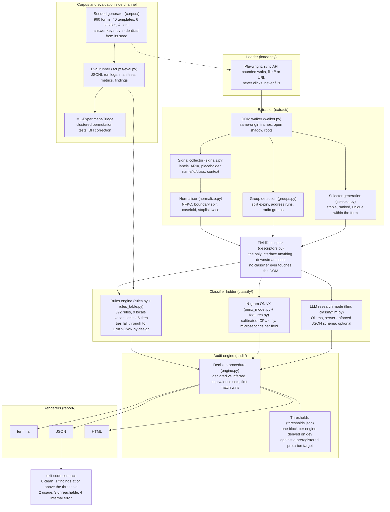

# autofill-audit

Audit HTML forms for browser autofill readiness. Every finding names its evidence, its confidence, and its one-line fix.

## The problem

A browser will autofill a form field only if the markup gives it enough to recognise the field. When it cannot, the user types their address by hand, on a phone, at the last step of a checkout. That is not a cosmetic defect. It is the point in the funnel where people give up.

The web platform already says how to avoid this. The [WHATWG HTML autofill section](https://html.spec.whatwg.org/multipage/form-control-infrastructure.html#autofill) defines a token set for the `autocomplete` attribute, and the [Chrome team's form guidance](https://web.dev/learn/forms/) explains what browsers do with it. The hard part is not knowing the rule. The hard part is finding, on a page you did not write, which of sixty controls are broken and what exactly to add to each one.

That is what this tool does.


The animation is regenerated from a committed fixture by [`scripts/make_demo_gif.sh`](scripts/make_demo_gif.sh), so it is reproducible rather than hand-edited. The full report that run produced is published here: [sample HTML report](docs/examples/checkout_hostile_report.html) ([rendered](https://htmlpreview.github.io/?https://github.com/Olajide-Badejo/Autofill_audit/blob/main/docs/examples/checkout_hostile_report.html)).

## How well does it actually work

Three documents answer that, in increasing order of length. Every number in all three resolves to a committed result file.

| | |
|---|---|
| [**`docs/report.md`**](docs/report.md) | The short answer, in markdown. Method, corpus, the headline experiment, and the honest result including the language model comparison whichever way it went. |
| [**`report/main.pdf`**](report/main.pdf) | The full write-up. The corpus design, the classifier ladder, the headline experiment in full with per-locale and per-tier grids, the statistical procedure, the pre-registered predictions beside their outcomes, and the limitations. |
| [**`report_debug/debug_report.pdf`**](report_debug/debug_report.pdf) | The record of what went wrong. Grouped by theme: DOM traversal, waiting and flake, normalisation, generator determinism, export fidelity, thresholds, language model behaviour, the package boundary, and a corpus design defect that invalidated a whole phase's ability to certify anything. |

The debug report is published deliberately. The honest record of what went wrong is the part of a project that ordinarily evaporates, and almost nobody publishes one.

## What it does

Point it at a URL or a local HTML file. It loads the page in a real browser, walks the DOM including same-origin frames and open shadow roots, collects the signals a browser's own heuristics would use, classifies each control against the specification's token set, and reports the controls that will not autofill together with the attribute to add.

Because the label space *is* the specification's token set, the fix is a formatting of the prediction rather than a translation of it. A control classified as `postal-code` produces the advice `add autocomplete="postal-code"`, and there is no second, undertested mapping in between.

## Status

`v1.0.0`. The extractor, the rule baseline, the audit engine, the three report
renderers, and the exit-code contract have been here since `v0.1.0`. The
classifier ladder has three rungs: a table of regular expressions, an n-gram
logistic regression calibrated on a held-out development split and exported to
ONNX, and an optional local language model that exists for the comparison rather
than for the product.

`--engine auto` is the default. It prefers the model when one loads and falls
back to the rule baseline with one printed line when none does, which is
documented behaviour rather than a failure. A published wheel does not currently
carry a model, so a `pipx` install runs the rule baseline until you train one or
point `AUTOFILL_AUDIT_MODEL_DIR` at a bundle.

**The measurements below say the n-gram model is the right default, and they say
so on accuracy rather than on speed.** They also say the rule baseline leads the
label-weighted average, and that the two averages disagree about which of the two
classical engines wins. Both are printed. The twelve-billion-parameter language
model came third on both.

## Install

```bash
pipx install autofill-audit
playwright install chromium
```

From a checkout:

```bash
python -m venv .venv && . .venv/bin/activate
pip install -e ".[dev,llm]"
playwright install chromium --with-deps
```

## Usage

Point it at a page. It exits 1 when something at or above the failure threshold
is found, so it drops straight into a pipeline.

```bash
autofill-audit audit https://example.com/checkout
autofill-audit audit ./checkout.html --format json --out report.json
autofill-audit audit ./checkout.html --format html --out report.html --fail-on warning
```

### The fix, before and after

This is the whole product in four lines. The field on the left will not autofill; the field on the right will.

```html
<!-- before: nothing tells the browser what this control is for -->
<input type="text" id="ck-email" placeholder="name@example.com">
```

```console
$ autofill-audit audit ./checkout.html
 #ck-email        MISSING_AUTOCOMPLETE
                  add autocomplete="email" to #ck-email
                  evidence: declaration:absent, label:email-words [rule tier HIGH]
```

```html
<!-- after: one attribute, and the browser fills it -->
<input type="email" id="ck-email" autocomplete="email"
       placeholder="name@example.com">
```

Three things in that output are the whole design.

**Every finding names its evidence.** `label:email-words` says which vocabulary
matched and which stream it matched in. A finding you cannot argue with is a
finding you cannot check, so there are none.

**The confidence is a tier, not a percentage, when a tier is what exists.** The
rule baseline is a table of regular expressions. It has no probabilities, so it
does not print any. The n-gram engine prints a calibrated probability, because it
has one. Turning a regex table's output into a percentage would assert a
frequency nobody has measured, which this project's third law forbids.

**A correct field is met with silence.** The correctly declared card-number input
on that page does not appear in the report at all. On a page where every field is
correct the whole report is one line saying so, and that property is a test over
the entire correct-markup slice of the corpus.

## Architecture



`FieldDescriptor` is the load-bearing contract. A classifier never sees the DOM
and never sees an answer key; it sees a descriptor. That boundary is why
selector generation, group detection, the honeypot rule and every normalisation
step are covered by tests that run in milliseconds without a browser.

### The findings, in brief

| Severity | Codes |
|---|---|
| `critical` | `MISSING_AUTOCOMPLETE`, `WRONG_AUTOCOMPLETE`, `OFF_SPEC_TOKEN` |
| `warning` | `AUTOCOMPLETE_OFF`, `UNLABELED_FIELD`, `PLACEHOLDER_AS_LABEL`, `SPLIT_FIELD`, `COMPOSITE_FIELD`, `UNDETECTABLE_FIELD` |
| `info` | `GENERIC_IDENTIFIER`, `WRONG_INPUT_TYPE`, `MISSING_NAME_ATTR`, `EXTRACTION_INCOMPLETE` |
| `note` | `LOW_CONFIDENCE` |

Each one, with its trigger, its exact fix text, and a before-and-after example,
is in [`docs/findings.md`](docs/findings.md), along with the exit-code contract
and the `autofill-audit.toml` format.

## Boundaries

These are deliberate boundaries, not missing features, and each one is a decision rather than an omission.

- **No crawling.** One page per invocation, plus the frames that page loads. There is no sitemap walker, no depth flag, and no queue.
- **No filling.** This is an auditor. It reads the DOM and reports. It never types into a field, never submits, and holds no profile of values to fill with.
- **No markup rewriting.** Findings carry a fix as text. There is no mode that edits your HTML, because rewriting a production template from a classifier's output is exactly the failure this project's first law exists to prevent.
- **The absent flags say so.** `--crawl`, `--depth`, `--fill`, `--fix`, and `--write` are each answered with the boundary they name and the reason for it, rather than with "no such option". Somebody will try each of them, and an unknown-option error reads like an oversight instead of a decision.
- **No scraped training data.** Nothing in this repository fetches HTML from a live site and keeps it. The corpus is generated.
- **No personal data.** Test fixtures use self-evidently invented names and addresses and the officially published test card numbers. No real name, address, phone number, email, or card number is present, including the author's own.
- **HTML forms only.** Native mobile forms, PDF forms, and canvas-rendered widgets are out of scope. A canvas is reported as undetectable rather than guessed at.
- **The tool does not verify that a browser autofills.** It verifies that the markup gives the browser what it needs. Those are different claims and only the second one is made.

## On accuracy

Every number below links to the committed result file that produced it. A CI job
follows each link to the file, from the file to its run manifest, and from the
manifest to a commit in this repository, and fails if any step does not resolve.
Nothing here is typed by hand, rounded from memory, or carried over from a design
document, and a result produced from a modified working tree is marked as such in
its manifest and may not be cited at all.

**These are measurements on a seeded synthetic corpus, not a claim about the open
web.** The corpus is generated by this repository, five form families of eight
templates each across six locales and four markup-quality tiers, with whole
templates assigned to the training, development and test splits so that no test
form shares an author with a training form. How the tool behaves on real pages is
unmeasured and is stated as unmeasured.

**This is the headline benchmark of the build specification's section 13.4:
three engines, six locales, four markup-quality tiers, on the test split.** The
predictions it was measured against were committed before it ran, in
[`experiments/predictions/p6-llm-comparison.md`](experiments/predictions/p6-llm-comparison.md),
and a CI job verifies that the prediction commit is an ancestor of every result
file below. Half of those predictions turned out to be wrong, and the section
that scores them says which.

An earlier measurement of the two classical engines was taken on a corpus whose
test partition held one template per family, which gave the clustered
significance test too few clusters to reach the pre-registered level at any
effect size. That was found and reported rather than worked around, and the
corpus was widened before anything else happened. Those result files are still
here, unedited, and nothing below cites them.

**The two deterministic engines reproduced the previous measurement exactly**,
every prediction and every finding, field for field across all 2317 fields
([rules](experiments/results/test/2026-08-26T21-15-35Z_p6-rules_6457ac7/run.jsonl),
[ngram](experiments/results/test/2026-08-26T21-17-53Z_p6-ngram_6457ac7/run.jsonl)).
Only the latency columns differ, because those are re-measured rather than
recomputed.

### What a developer experiences

The finding-level numbers come first because they are what a user of the tool
actually sees: they run through the decision procedure and the thresholds rather
than reporting raw classifier accuracy.

| Engine | `MISSING_AUTOCOMPLETE` precision | Accusations | Recall | Fields needing one | Result file |
|---|---|---|---|---|---|
| `rules` | 1.0000 | 449 | 0.5684 | 790 | [metrics.json](experiments/results/test/2026-08-26T21-15-35Z_p6-rules_6457ac7/metrics.json) |
| `ngram` | 0.9731 | 334 | 0.4114 | 790 | [metrics.json](experiments/results/test/2026-08-26T21-17-53Z_p6-ngram_6457ac7/metrics.json) |
| `llm` | 0.7803 | 692 | 0.6835 | 790 | [metrics.json](experiments/results/test/2026-08-26T20-32-48Z_p6-llm_6457ac7/metrics.json) |

The rule baseline was right about every field it accused. The language model
found the most real defects and was wrong about roughly one accusation in five
([metrics.json](experiments/results/test/2026-08-26T20-32-48Z_p6-llm_6457ac7/metrics.json)),
which on a developer tool means a fifth of the work it hands you is work you
should not do.

The other accusation code, `WRONG_AUTOCOMPLETE`, splits the engines:

| Engine | `WRONG_AUTOCOMPLETE` precision | Accusations | Recall | Fields needing one | Result file |
|---|---|---|---|---|---|
| `rules` | insufficient data | 28 | 0.9333 | 30 | [metrics.json](experiments/results/test/2026-08-26T21-15-35Z_p6-rules_6457ac7/metrics.json) |
| `ngram` | insufficient data | 23 | 0.7000 | 30 | [metrics.json](experiments/results/test/2026-08-26T21-17-53Z_p6-ngram_6457ac7/metrics.json) |
| `llm` | 0.2320 | 125 | 0.9667 | 30 | [metrics.json](experiments/results/test/2026-08-26T20-32-48Z_p6-llm_6457ac7/metrics.json) |

Thirty fields needed that accusation, which meets the reporting minimum this
project fixed before it had any numbers, so every recall is reported. Precision
is withheld for the two classical engines because neither made thirty
accusations, and reported for the language model because it made a hundred and
twenty-five. **The asymmetry is the finding, not a formatting inconsistency**: the
engine whose precision can be reported is the one that accused often enough to
be measured, and the number that came back is in the table above ([metrics.json](experiments/results/test/2026-08-26T20-32-48Z_p6-llm_6457ac7/metrics.json)).

**Read these rows as a comparison of three policies, not three classifiers.**
Each engine speaks under its own rule about when to speak. The n-gram engine
speaks when a calibrated probability clears a boundary derived against a
<!-- traceability: the target is a pre-registered policy constant in thresholds.json, not a measurement -->
precision target of 0.98; the rule baseline speaks when a regular expression
matches at a tier a documented mapping calls confident; **the language model
speaks whenever it has an answer**, because its confidence is self-reported and
the build specification forbids a self-reported number from gating anything. Its
threshold block is zero and zero, that was registered before the run, and the
precision column above is the consequence.

### The classifier comparison

| Engine | macro-F1 | micro-F1 | macro-F1, seen locales | macro-F1, unseen locale | Result file |
|---|---|---|---|---|---|
| `rules` | 0.7911 | 0.7678 | 0.7991 | 0.7276 | [metrics.json](experiments/results/test/2026-08-26T21-15-35Z_p6-rules_6457ac7/metrics.json) |
| `ngram` | 0.7394 | 0.8226 | 0.7735 | 0.5637 | [metrics.json](experiments/results/test/2026-08-26T21-17-53Z_p6-ngram_6457ac7/metrics.json) |
| `llm` | 0.6353 | 0.6953 | 0.6373 | 0.6045 | [metrics.json](experiments/results/test/2026-08-26T20-32-48Z_p6-llm_6457ac7/metrics.json) |
| `bert-onnx-int8` | absent | absent | absent | absent | not built; it is phase P8 |

The language model is `mistral-nemo:12b-instruct-2407-q4_K_M`, a 12-billion
parameter instruction model at 4-bit quantization, running on a local GPU through
Ollama with the response schema enforced by the server. The tag and the
quantization are recorded in every row of its run log, because a table that named
neither would not say what it had measured.

**The 12-billion-parameter model came third on both averages** ([metrics.json](experiments/results/test/2026-08-26T20-32-48Z_p6-llm_6457ac7/metrics.json)).
The two averages disagree about which of the two classical engines won and agree
about which came last. Macro weights every label equally and the rule baseline
leads it; micro weights every field equally and the n-gram model leads that.
Neither average is the right one, so both are here.

The unseen-locale column is the multilingual claim's actual test: French forms
whose templates are also unseen. It is the **one** column where the language
model beats the n-gram model ([analysis.json](experiments/results/analysis/2026-08-26T21-20-11Z_p6-analysis_6457ac7/analysis.json)),
and that difference does not survive the correction across the comparison family.
It is also the column where the rule table beats them both.

Per markup-quality tier:

| Engine | clean | partial | mixed | hostile | Result file |
|---|---|---|---|---|---|
| `rules` | 0.8677 | 0.8677 | 0.8005 | 0.4681 | [metrics.json](experiments/results/test/2026-08-26T21-15-35Z_p6-rules_6457ac7/metrics.json) |
| `ngram` | 0.9350 | 0.9290 | 0.7151 | 0.5409 | [metrics.json](experiments/results/test/2026-08-26T21-17-53Z_p6-ngram_6457ac7/metrics.json) |
| `llm` | 0.6696 | 0.6522 | 0.6352 | 0.5265 | [metrics.json](experiments/results/test/2026-08-26T20-32-48Z_p6-llm_6457ac7/metrics.json) |

Macro-F1 per tier. **The language model is the flattest engine and the worst one
almost everywhere.** It loses to both on clean, partial and mixed markup by
margins the significance test certifies, and on the hostile tier the three
converge, as the row above shows ([metrics.json](experiments/results/test/2026-08-26T20-32-48Z_p6-llm_6457ac7/metrics.json)).
The hostile tier was the slice where broad pretrained knowledge was predicted to
help most. It is the slice where all three engines are worst and where none of
the differences is significant.

Abstention:

| Engine | Answers `UNKNOWN` on | Accuracy on the rest | Result file |
|---|---|---|---|
| `rules` | 0.2620 | 0.9702 | [metrics.json](experiments/results/test/2026-08-26T21-15-35Z_p6-rules_6457ac7/metrics.json) |
| `ngram` | 0.0363 | 0.8204 | [metrics.json](experiments/results/test/2026-08-26T21-17-53Z_p6-ngram_6457ac7/metrics.json) |
| `llm` | 0.0255 | 0.7037 | [metrics.json](experiments/results/test/2026-08-26T20-32-48Z_p6-llm_6457ac7/metrics.json) |

The system prompt tells the model to answer `UNKNOWN` when the evidence is
insufficient and not to guess. **It abstained less than either classical engine
and was right less often when it committed**
([metrics.json](experiments/results/test/2026-08-26T20-32-48Z_p6-llm_6457ac7/metrics.json)).
Instructing a model to decline is not the same as giving it a threshold, and this
is the measurement of the difference.

### Latency, in the context that decides whether it matters

| Engine | p50 | p95 | p99 | Result file |
|---|---|---|---|---|
| `rules` | 35.2 | 134.0 | 194.7 | [metrics.json](experiments/results/test/2026-08-26T21-15-35Z_p6-rules_6457ac7/metrics.json) |
| `ngram` | 165.6 | 261.5 | 355.1 | [metrics.json](experiments/results/test/2026-08-26T21-17-53Z_p6-ngram_6457ac7/metrics.json) |
| `llm` | 524189.3 | 674727.4 | 774080.6 | [metrics.json](experiments/results/test/2026-08-26T20-32-48Z_p6-llm_6457ac7/metrics.json) |

Microseconds per field. The two classical engines run on a CPU with the ONNX
session warmed and its threads pinned, and both are comfortably inside a
millisecond. The language model runs on a warmed GPU and is **about five thousand
times slower than the rule table at the 95th percentile**
([metrics.json](experiments/results/test/2026-08-26T20-32-48Z_p6-llm_6457ac7/metrics.json)).

**The language model's figure is a share, not a measurement.** It classifies a
whole page in one request, so its per-field number is a batch's elapsed time
divided by the fields in that batch. Batching amortises the round trip, which
makes the figure flattering rather than harsh, and it is not comparable against a
per-call measurement. The engine's own model card and run manifest say so.

The context that decides whether latency matters:

| Engine | Share of wall time spent loading and extracting the page | Result file |
|---|---|---|
| `rules` | 0.9912 | [metrics.json](experiments/results/test/2026-08-26T21-15-35Z_p6-rules_6457ac7/metrics.json) |
| `ngram` | 0.9874 | [metrics.json](experiments/results/test/2026-08-26T21-17-53Z_p6-ngram_6457ac7/metrics.json) |
| `llm` | 0.0537 | [metrics.json](experiments/results/test/2026-08-26T20-32-48Z_p6-llm_6457ac7/metrics.json) |

**This is the row that turns a latency difference into a product difference.**
For the two classical engines the browser is the cost and the classifier is a
rounding error on a page load, so celebrating the difference between their
latency columns would be celebrating nothing. For the language model that
reverses: the browser becomes a twentieth of the wall time and the classifier becomes the rest ([metrics.json](experiments/results/test/2026-08-26T20-32-48Z_p6-llm_6457ac7/metrics.json)).
One is a classifier you do not wait for. The other is one you do.

**It is also the finding most likely to survive contact with real pages**, because
it does not depend on the corpus being synthetic. The accuracy gap does.

### What the language model cost, and what it did not

| Quantity | Value | Result file |
|---|---|---|
| Requests | 480 | [metrics.json](experiments/results/test/2026-08-26T20-32-48Z_p6-llm_6457ac7/metrics.json) |
| Attempts | 480 | [metrics.json](experiments/results/test/2026-08-26T20-32-48Z_p6-llm_6457ac7/metrics.json) |
| Requests needing a retry | 0 | [metrics.json](experiments/results/test/2026-08-26T20-32-48Z_p6-llm_6457ac7/metrics.json) |
| Requests still failing after the retry | 0 | [metrics.json](experiments/results/test/2026-08-26T20-32-48Z_p6-llm_6457ac7/metrics.json) |
| Fields scored `UNKNOWN` by a schema failure | 0 | [metrics.json](experiments/results/test/2026-08-26T20-32-48Z_p6-llm_6457ac7/metrics.json) |
| Prompt tokens | 677632 | [metrics.json](experiments/results/test/2026-08-26T20-32-48Z_p6-llm_6457ac7/metrics.json) |
| Completion tokens | 159126 | [metrics.json](experiments/results/test/2026-08-26T20-32-48Z_p6-llm_6457ac7/metrics.json) |
| Monetary cost | null, not zero | [metrics.json](experiments/results/test/2026-08-26T20-32-48Z_p6-llm_6457ac7/metrics.json) |

**Schema compliance was perfect and that was not predicted.** The registered
prediction was that between zero and five percent of requests would need a retry.
Not one did
([metrics.json](experiments/results/test/2026-08-26T20-32-48Z_p6-llm_6457ac7/metrics.json)).
Passing the JSON schema with the request and letting the server constrain
decoding appears to remove the failure mode that the retry ladder exists for. The
ladder is still there, still tested against recorded malformed responses, and on
this run it never fired.

Cost is recorded as null rather than zero because the calls were local. Zero is a
measurement and the electricity was not free; null is the absence of one.

### Is the difference significant

**For the language model against both classical engines, yes, in most slices.**

Fields inside one form template share an author, so the significance test
resamples whole templates rather than individual fields. The test split holds ten
templates, which gives an exact paired sign-flip space of one thousand and
twenty-four arrangements and a smallest attainable two-sided p value well below the level ([analysis.json](experiments/results/analysis/2026-08-26T21-20-11Z_p6-analysis_6457ac7/analysis.json)),
<!-- traceability: the level is a pre-registered policy constant, fixed before the runs in experiments/predictions/p5-statistical-policy.md -->
which is the false-discovery level of 0.05 fixed before any of these
runs. Every comparison is decidable and **none is reported as inconclusive for
design reasons**
([analysis.json](experiments/results/analysis/2026-08-26T21-20-11Z_p6-analysis_6457ac7/analysis.json)).

The family is **all three engine pairs over the same eleven comparisons, 33 in
total, corrected together**. That membership was fixed in the prediction file
before the runs, because the comparison this phase existed to make was the one
against the language model, and a family containing only that pair would have
been a third the size and would have produced smaller adjusted p values for
exactly the comparisons the project most wanted to report.

| Outcome | Count | Result file |
|---|---|---|
| Improvement | 11 | [analysis.json](experiments/results/analysis/2026-08-26T21-20-11Z_p6-analysis_6457ac7/analysis.json) |
| Regression | 5 | [analysis.json](experiments/results/analysis/2026-08-26T21-20-11Z_p6-analysis_6457ac7/analysis.json) |
| Significant but below the practical threshold | 0 | [analysis.json](experiments/results/analysis/2026-08-26T21-20-11Z_p6-analysis_6457ac7/analysis.json) |
| No significant change | 17 | [analysis.json](experiments/results/analysis/2026-08-26T21-20-11Z_p6-analysis_6457ac7/analysis.json) |
| Inconclusive, the design cannot reach alpha | 0 | [analysis.json](experiments/results/analysis/2026-08-26T21-20-11Z_p6-analysis_6457ac7/analysis.json) |

The middle row is reported even though it is empty, because a summary listing
only the categories that occurred would drop it on exactly the runs where nothing
landed in it.

**Certified against the language model, after correction:** the rule table leads
it overall and on the seen locales, and both classical engines lead it on clean
and partial markup, every one of them clearing the level ([analysis.json](experiments/results/analysis/2026-08-26T21-20-11Z_p6-analysis_6457ac7/analysis.json)).
The language model's `MISSING_AUTOCOMPLETE` recall is certified **better** than
both, and its precision on both accusation codes certified **worse** than both.

**Not certified:** everything on the hostile tier, everything on the unseen
locale, and the language model against the n-gram model overall
([analysis.json](experiments/results/analysis/2026-08-26T21-20-11Z_p6-analysis_6457ac7/analysis.json)).
Those are the slices where the language model was expected to do well, and the
honest report of them is that the differences are not large enough to call at ten
clusters, in either direction.

One consequence was registered in advance and arrived as predicted: **every
rules-against-ngram comparison carries a larger adjusted p here than the same
comparison carried when it was corrected inside a family of eleven.** The
underlying p values did not move. The earlier analysis file is untouched.

### The question this project exists to answer

The build specification puts it directly:

<!-- traceability: a quotation of the build specification's own question, not a measurement -->
> Does a 50-kilobyte linear model that runs in microseconds on a CPU get close
> enough to a 12-billion-parameter model to be the right default for a developer
> tool?

**The premise did not survive the measurement.** The linear model did not have to
get close to the language model, because it beat it on both averages, as the classifier table above records ([ngram](experiments/results/test/2026-08-26T21-17-53Z_p6-ngram_6457ac7/metrics.json), [llm](experiments/results/test/2026-08-26T20-32-48Z_p6-llm_6457ac7/metrics.json)).
The rule table beat both. On this corpus, at this quantization, with this prompt,
**the fifty-kilobyte model is not the compromise. It is the better classifier**,
and it is also five thousand times faster, needs no GPU, and adds nothing to the
install.

That answer is narrower than it sounds and the limits are part of it. It is one
12B model at 4-bit, one prompt, one synthetic corpus, and a task whose entire
input is a short list of attribute strings, which is close to the worst case for
a system whose advantage is world knowledge and nearly the best case for one that
memorises naming conventions. The language model was not fine-tuned, and the two
classical engines were fitted on this corpus's own training split. A different
model, a better prompt, or real-world pages could all move this, and none of them
has been tried here.

What the measurement does support is the product decision, and it supports it
more strongly than expected: the n-gram model is the right default, and on these
numbers it is the right default on accuracy alone, before latency or footprint
enters the argument.

### What was predicted, and what was wrong

Eight predictions were committed before the benchmark ran. Four held and four did
not, and the four that did not are the more interesting half.

| # | Prediction | Outcome | Result file |
|---|---|---|---|
| 1 | It beats the n-gram model on the hostile tier | **Wrong**, it lost | [metrics.json](experiments/results/test/2026-08-26T20-32-48Z_p6-llm_6457ac7/metrics.json) |
| 2 | It beats the n-gram model on the unseen locale | Held, but not significant | [analysis.json](experiments/results/analysis/2026-08-26T21-20-11Z_p6-analysis_6457ac7/analysis.json) |
| 3 | It does not beat the rule table on the unseen locale | Held | [analysis.json](experiments/results/analysis/2026-08-26T21-20-11Z_p6-analysis_6457ac7/analysis.json) |
| 4 | Latency differs by three orders of magnitude or more | Held | [metrics.json](experiments/results/test/2026-08-26T20-32-48Z_p6-llm_6457ac7/metrics.json) |
| 5 | Schema failures above zero and below five percent | **Wrong**, exactly zero | [metrics.json](experiments/results/test/2026-08-26T20-32-48Z_p6-llm_6457ac7/metrics.json) |
| 6 | The n-gram model stays the right default | Held, for a stronger reason | [analysis.json](experiments/results/analysis/2026-08-26T21-20-11Z_p6-analysis_6457ac7/analysis.json) |
| 7 | `tel-national` read as `tel` occurs, `username` against `email` does not | Held, both directions | [metrics.json](experiments/results/test/2026-08-26T20-32-48Z_p6-llm_6457ac7/metrics.json) |
| 8 | Abstention lands between the two classical engines | **Wrong**, below both | [metrics.json](experiments/results/test/2026-08-26T20-32-48Z_p6-llm_6457ac7/metrics.json) |

A ninth prediction, about which confusions would dominate, was also wrong and in
an informative direction. The failure was expected to be over-claiming: fields
that are not personal data read as though they were. The largest single confusion
is the reverse, fields whose answer key is `UNKNOWN` read as `NOT_AUTOFILLABLE` ([metrics.json](experiments/results/test/2026-08-26T20-32-48Z_p6-llm_6457ac7/metrics.json)).
The model declines more readily than predicted on the fields where declining is
wrong, while declining less readily overall than either classical engine.

The same rule applies to estimates. Anything estimated rather than measured is
labeled as an estimate where it is displayed.

### One known limitation of the evaluation itself

The evaluation runner classifies every form twice: once directly, which is where
the run log's predicted label and per-field latency come from, and once through
the audit engine, which is where the finding codes come from. For the two
deterministic engines the passes agree by construction. For the language model
they are two draws of a model that is not guaranteed to be deterministic, and the
excess disagreement between a row's label and its finding codes is on the order
of two fields in seven hundred.

It is small, it is real, and it should be known before anyone builds on the
finding-level numbers. It is not fixed here, because changing what the runner
does for every engine after seeing the results is the regeneration this project's
reproducibility rules forbid. The fix and the reasoning are in
[`report_debug/debug_report.pdf`](report_debug/debug_report.pdf) and in
[`docs/report.md`](docs/report.md).

## The research layer

Alongside the tool there is an honest evaluation: a seeded synthetic corpus with answer keys, a ladder of classifiers from a rule table to an n-gram model to a local large language model, and statistical significance decided by an external harness.

That harness is [ML-Experiment-Triage](https://github.com/Olajide-Badejo/ML-Experiment-Triage), a separate, independently released package, and it stays separate on purpose. A piece of infrastructure with exactly one consumer has not been shown to be infrastructure; it has been shown to be part of that one program. This project is its second consumer, across a real package boundary, and the friction that boundary exposes is recorded in [`docs/cross-repo-tasks.md`](docs/cross-repo-tasks.md) rather than smoothed away by vendoring the code.

The split runs cleanly through the middle of that package, and where it runs is
the result: its statistical primitives fit exactly and were used unchanged, and
its data model, its ingestion layer and its comparison entry points did not fit
at all, because they model a training run observed over time and this project
measures a set of items observed once. Five issues are open there, each with a
concrete API proposal, and the ledger records them.

## Roadmap

The build order is deliberate and the reason is worth stating: **the tool becomes
useful before any machine learning exists.**

| Phase | What lands |
|---|---|
| P0 | Repository, packaging, taxonomy, the six CI gates, the toolchain record |
| P1 | The seeded corpus generator, locale profiles, answer keys, the split policy |
| P2 | The Playwright extractor: DOM walk, frames, shadow roots, signal collection |
| P3 | The rule baseline, the audit engine, three renderers, the CLI. First usable release |
| P4 | The n-gram classifier, calibration, ONNX export, the model card |
| P5 | Metrics, run logs, statistical significance through the external harness |
| P5R | The corpus power repair, after the first design proved unable to certify anything |
| P6 | The optional local language model comparison and the headline benchmark |
| P7 | The full documentation set and the three compiled reports |
| P8 | The transformer stretch, conditional and not built |

P3 is the milestone that matters to somebody who just wants their checkout page
fixed, and it shipped as `v0.1.0`. Everything after it buys accuracy and evidence
rather than usefulness, and a project that shipped the model first and the
product last would have no way to tell whether the model was solving a problem
anybody has.

## Documentation

- [`docs/report.md`](docs/report.md): how well it actually works, in short.
- [`report/main.pdf`](report/main.pdf) and [`report_debug/debug_report.pdf`](report_debug/debug_report.pdf): the full write-up and the record of what went wrong.
- [`docs/taxonomy.md`](docs/taxonomy.md): the label set, the extras and their justifications, the growth rule, and locale provider status.
- [`docs/findings.md`](docs/findings.md): every finding code with its trigger, severity, fix template and a worked example.
- [`docs/model-card.md`](docs/model-card.md): the shipped model, its training data, its measured behaviour, and what is unmeasured.
- [`docs/environment.md`](docs/environment.md): the resolved toolchain and the machine it was resolved on.
- [`docs/adr/`](docs/adr/): architecture decision records.
- [`docs/ENGINEERING_LOG.md`](docs/ENGINEERING_LOG.md): dated, append-only, including what went wrong.
- [`docs/cross-repo-tasks.md`](docs/cross-repo-tasks.md): the ledger for the dependency boundary.
- [`docs/ci-proof.md`](docs/ci-proof.md): every CI job observed failing, with run links, because a gate that has only ever been green is indistinguishable from a gate that always returns green.
- [`docs/references.md`](docs/references.md): sources, with retrieval dates.
- [`CONTRIBUTING.md`](CONTRIBUTING.md): the phase-gate discipline, the four laws, and the synthetic-data-only rule.
- [`CHANGELOG.md`](CHANGELOG.md): keepachangelog format.

## Contributing

The most valuable contribution is a false positive report: a page where the tool
accused a field it should not have. That is the feedback channel that improves
the thing the tool is judged on, and there is an issue template for it. Read
[`CONTRIBUTING.md`](CONTRIBUTING.md) first, because this repository has rules that
are unusual and mechanical.

## License

MIT. See [`LICENSE`](LICENSE).
